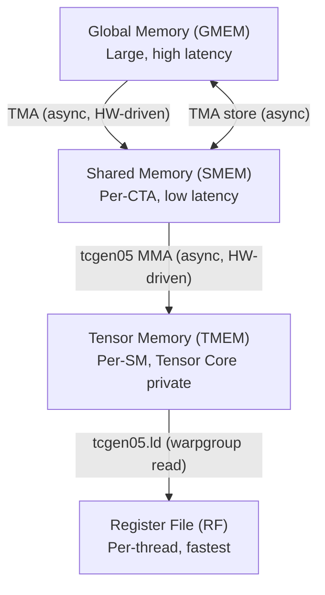

## Background: Blackwell GPU Architecture

Before diving into the code, let's understand the key hardware features of NVIDIA Blackwell (SM100) GPUs that make high-performance GEMM possible. If you're familiar with CUDA, you already know about threads, warps, shared memory, and global memory. Blackwell introduces several new hardware units and memory spaces.

### Memory Hierarchy

Blackwell extends the traditional GPU memory hierarchy with new levels:

- **Tensor Memory (TMEM)** is new in Blackwell. It is a high-bandwidth scratchpad memory private to the Tensor Cores. The tcgen05 MMA unit writes its output directly to TMEM (not to registers or shared memory). To read the results, you must explicitly load from TMEM to the register file. Reading TMEM requires all 128 threads in a **warpgroup** (4 consecutive warps) to cooperate.

- **TMEM is not directly addressable** by normal instructions — it is accessed through a special 2D address space with rows (mapped to threads) and columns. TMEM must be explicitly allocated before use and deallocated afterward.

### TMA (Tensor Memory Accelerator)

TMA is a hardware unit that asynchronously copies rectangular tiles between global memory and shared memory (both load and store). Key advantages over manual data movement:

- **No thread involvement**: A single thread issues the TMA command; the hardware handles the actual data transfer in the background. Other threads don't need to participate.
- **Swizzled layouts**: TMA hardware automatically applies address swizzling during the transfer, ensuring bank-conflict-free access for Tensor Cores.
- **Byte counting**: TMA loads work with mbarriers — the programmer tells the barrier how many bytes to expect, and the hardware automatically signals it once that many bytes have been transferred. TMA stores use a separate completion mechanism (commit group + wait).

### tcgen05 (Tensor Core MMA)

`tcgen05` is Blackwell's matrix multiply-accumulate (MMA) unit. It reads A and B operands from shared memory and writes the result to tensor memory. Key properties:

- **Asynchronous**: The MMA instruction returns immediately; computation runs in the background.
- **Single-thread dispatch**: Only one elected thread per warp issues MMA and commit. Other threads do not participate.
- **Accumulation mode**: The MMA can either overwrite TMEM or add to existing values. The first iteration of a K-loop overwrites; subsequent iterations accumulate partial results.
- **Commit + mbarrier**: After issuing one or more MMAs, a commit groups them together. The hardware will signal the specified mbarrier when all MMAs in that group complete. The commit itself returns immediately — the mbarrier is signaled later when the hardware finishes.
- **cta_group**: Controls how many CTAs cooperate on a single MMA. With cta_group=2, only CTA-0 issues the MMA instruction, but the hardware reads B from **both** CTAs' shared memory via the cluster address space, producing a wider output (2x columns). Each CTA still loads its own A tile (different M rows).

### mbarrier (Memory Barrier)

mbarriers are hardware synchronization primitives stored in shared memory. They combine a counter with a phase bit to enable reusable, asynchronous synchronization.

**Lifecycle of an mbarrier:**

1. **Init**: Set the expected number of arrivals. The barrier starts at phase 0.
2. **Arrive**: Each arrival decrements the counter. There are three ways to arrive:
   - **TMA auto-arrive**: When you issue a TMA load targeting an mbarrier, the hardware arrives automatically once the byte transfer completes. You tell the barrier how many bytes to expect beforehand.
   - **tcgen05 auto-arrive**: When you commit a group of MMAs to an mbarrier, the hardware arrives once those MMAs complete.
   - **Thread arrive**: A thread arrives explicitly (used, e.g., by writeback threads to signal "TMEM is free").
3. **Wait**: Block until the barrier's current phase matches the expected phase — meaning all arrivals for that round have occurred.
4. **Phase flip**: Once all arrivals are done, the barrier automatically toggles its phase (0 → 1 → 0 → ...). This lets the same barrier be reused across loop iterations without confusion: iteration 0 uses phase 0, iteration 1 uses phase 1, iteration 2 uses phase 0 again, and so on. The caller tracks the expected phase and flips it after each wait.

This is the key to overlapping computation with memory transfers: TMA automatically arrives on a barrier when data is ready, and the MMA warp waits on that barrier before computing.

### Synchronization Rules

Blackwell has multiple asynchronous hardware units (threads, TMA, tcgen05 MMA) that read and write different memory spaces (GMEM, SMEM, TMEM, registers). Whenever data crosses from one unit or memory space to another, you need explicit synchronization to ensure the producer is done before the consumer reads. The general pattern is:

| Data flow | Synchronization needed |
|---|---|
| Threads write SMEM → MMA reads SMEM | `cta_sync()` (wait for all threads) + `fence.after_thread_sync()` (make SMEM visible to MMA hardware) |
| MMA writes TMEM → Threads read TMEM | `mbarrier.try_wait` (wait for MMA to complete) + `fence.after_thread_sync()` (make TMEM visible to subsequent reads) |
| Threads write SMEM → TMA reads SMEM (store) | `fence.proxy_async("shared::cta")` (flush SMEM writes) |
| Alloc barriers/TMEM → Use them | `fence.proxy_async` + `fence.mbarrier_init` + `cta_sync()` |
| All work done → Deallocate TMEM | `cta_sync()` for single-CTA kernels, `cluster_sync()` for cluster kernels. Ensures all CTAs are done before any CTA deallocates. |

The key insight: `cta_sync()` synchronizes **threads** with each other, but the MMA and TMA hardware operate independently from threads. Fences (`fence.after_thread_sync`, `fence.proxy_async`) bridge the gap between thread-visible memory and hardware-visible memory.

### CTA Clusters

Blackwell supports **CTA clusters** — groups of CTAs that can cooperate via:

- **shared::cluster memory**: CTAs in the same cluster can access each other's shared memory.
- **Multicast TMA**: A single TMA command can deliver the same data to multiple CTAs simultaneously, reducing global memory bandwidth.
- **Cross-CTA barrier signaling**: mbarrier arrive/wait across CTAs in the cluster.

For GEMM, clustering enables the MMA to cross-read B from both CTAs' shared memory, effectively doubling the output width without additional global memory bandwidth. This is used in steps 9-10.