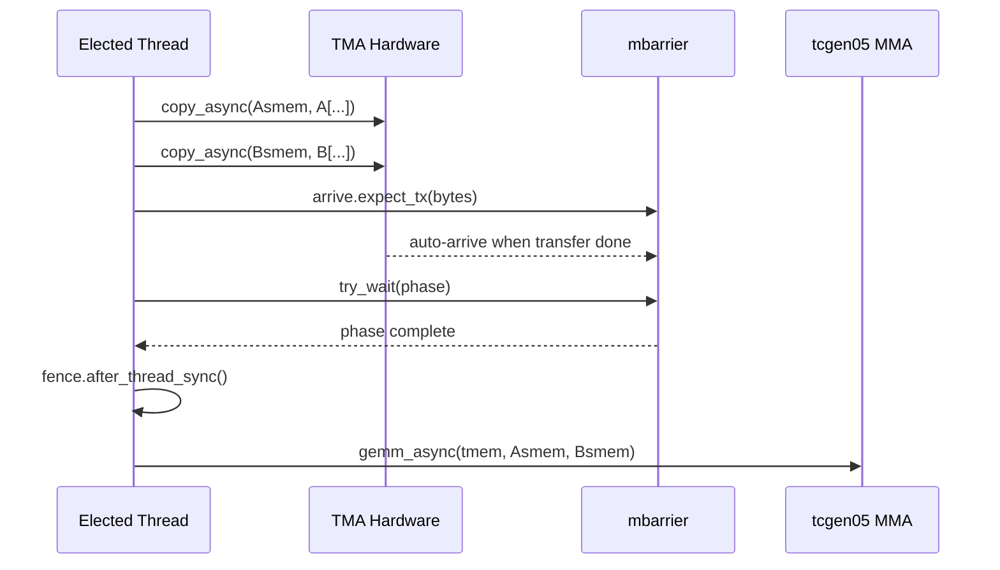

### Step 4: TMA Async Load

**What you will learn:**
- Replacing synchronous `Tx.copy` with asynchronous TMA: `Tx.copy_async(..., dispatch="tma")`
- Single-thread TMA dispatch via `Tx.ptx.elect_sync()`
- mbarrier-based byte-counting synchronization: `arrive.expect_tx` / `try_wait`
- TMA store writeback: TMEM -> RF -> SMEM -> TMA store -> GMEM

**Background:**

Synchronous loads waste thread resources — all 128 threads sit idle while the memory controller fetches data. TMA offloads this entirely to hardware: one thread issues the command, and the TMA unit handles the rest asynchronously.

The synchronization flow is:

The `expect_tx` call tells the mbarrier how many bytes the TMA will transfer. When TMA finishes transferring exactly that many bytes, the barrier automatically transitions.

**Writeback with TMA store:**

Instead of writing directly from registers to GMEM (slow, uncoalesced), we use TMA store:
1. Read TMEM -> registers
2. Cast fp32 -> fp16 in registers
3. Write registers -> Dsmem (shared memory, with swizzled layout)
4. TMA store: `Tx.copy_async(D[...], Dsmem[:,:], dispatch="tma")` — one thread issues TMA store
5. Wait for TMA store completion: `Tx.ptx.cp_async.bulk.commit_group()` + `Tx.ptx.cp_async.bulk.wait_group(0)`

Note: TMA **loads** signal completion via mbarrier (byte counting). TMA **stores** use a different mechanism — commit group + wait group — because there is no consumer that needs to be notified; you just need to ensure the store finishes before reusing the Dsmem buffer.

This requires allocating a `Dsmem` buffer with a TMA-compatible swizzled layout (`tma_shared_layout` — same helper used for Asmem/Bsmem).

**Implementation hints:**
- Use `@Tx.inline` to define helper functions (e.g., `tma_load`, `mma`) inside the kernel. These are inlined at compile time and can capture outer variables like `Asmem`, `tma_bar`, etc.
- Only one thread issues TMA and MMA. You can use `if warp_id == 0:` with `elect_sync()` (as in step 1), or compute `tid = Tx.meta_var(warp_id * 32 + lane_id)` and use `with Tx.thread(parent="warpgroup")[tid == 0]:`.
- TMA config: `{"dispatch": "tma", "cta_group": 1, "mbar": tma_bar.ptr_to([0])}`
- Byte count: `(BLK_M * BLK_K + BLK_N * BLK_K) * 2` (fp16 = 2 bytes)
- Use `Tx.ptx.mbarrier.init(tma_bar.ptr_to([0]), 1)` — 1 expected arrival from the expect_tx call.

**Test:** `pytest tests/test_step04.py -xvs`