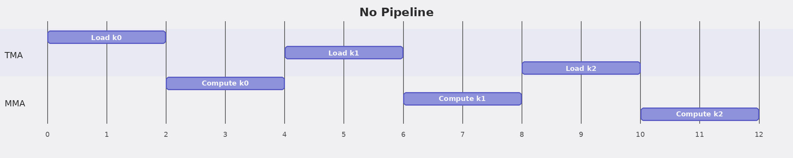

### Step 5: Software Pipeline (PIPE_DEPTH=2)

**What you will learn:**
- Overlapping TMA loads with MMA computation using double buffering
- Multi-buffered shared memory: `Asmem[stage, :, :]`
- Pipeline stage and phase tracking 
- Prefetch loop pattern

**Background:**

Without pipelining, the kernel alternates between loading and computing:

With a 2-stage pipeline, we overlap loading the next tile with computing the current one:

This requires double-buffered SMEM: `Asmem[0, :, :]` and `Asmem[1, :, :]`. While the MMA reads from stage 0, TMA loads into stage 1, and vice versa.

Each stage has its own mbarrier and phase counter. The pattern is:
1. **Prefetch**: Load the first `PRE_NUM` stages.
2. **Main loop**: For each K tile, wait for load to finish, compute, then issue the next load.

**Implementation hints:**
- `PIPE_DEPTH = 2`
- `Asmem = pool.alloc((PIPE_DEPTH, BLK_M, BLK_K), ...)`
- `tma_bar = pool.alloc((PIPE_DEPTH,), "uint64", ...)`
- Stage tracking: `stage = k % PIPE_DEPTH`
- Phase flips when stage wraps back to 0: `phase ^= 1`

**Test:** `pytest tests/test_step05.py -xvs`