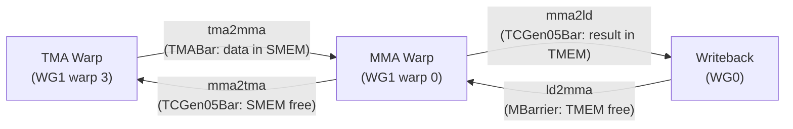

### Step 7: Warp Specialization (PIPE_DEPTH=2)

**What you will learn:**
- Warp specialization: dedicating different warps/warpgroups to different tasks
- High-level barrier abstractions: `TMABar`, `TCGen05Bar`, `MBarrier`
- `PipelineState` for automatic stage/phase management
- The producer-consumer synchronization chain

**Background:**

This is the biggest architectural change. Instead of all threads doing load-then-compute sequentially, we dedicate specific warps to specific tasks:

- **WG1, warp 3**: TMA producer — continuously loads A and B tiles
- **WG1, warp 0**: MMA consumer — continuously runs MMA as soon as data is ready
- **WG0**: Writeback — reads results from TMEM and writes to GMEM

This requires four types of barriers to synchronize the three actors:



- **tma2mma** (`TMABar`): TMA signals MMA "data is in SMEM". TMA hardware auto-arrives via byte counting.
- **mma2tma** (`TCGen05Bar`): MMA signals TMA "SMEM can be reused". tcgen05 hardware auto-arrives via `commit`.
- **mma2ld** (`TCGen05Bar`): MMA signals writeback "results are in TMEM".
- **ld2mma** (`MBarrier`): Writeback signals MMA "TMEM is free for next tile". Threads arrive manually.

`PipelineState` manages stage indices and phase counters automatically:
```python
tma_phase = PipelineState("tma", PIPE_DEPTH)
tma_phase.init(is_producer=True)
# Use tma_phase.stage (current stage index) and tma_phase.phase (current phase)
tma_phase.move_to_next_stage()  # Advance to next stage
```

**`is_producer` controls the initial phase.** Barriers start at phase 0. `try_wait(bar, phase)` blocks until the barrier's phase equals the given phase.
- `is_producer=True` → initial phase = 1. The first `wait(stage, phase=1)` sees barrier phase 0 ≠ 1, so it **passes immediately** — the producer can write without waiting (buffers start empty).
- `is_producer=False` → initial phase = 0. The first `wait(stage, phase=0)` sees barrier phase 0 == 0, so it **blocks** — the consumer waits for the producer to fill data first.

Getting this wrong causes either deadlock (producer waits for consumer who waits for producer) or data corruption (consumer reads before producer writes).

`TCGen05Bar.arrive` takes a `cta_mask` parameter. For non-cluster kernels (single CTA), use `cta_mask=1`. For cluster kernels (step 9+), use `cta_mask=3` to multicast the signal to both CTAs.

**Epilogue (writeback) structure:**
1. Wait for MMA completion: `mma2ld.wait`, then `fence.after_thread_sync()` to make TMEM data visible
2. Read TMEM to registers (can be done in chunks to reduce register pressure)
3. Cast fp32 -> fp16, accumulate into `Dreg_16b`
4. Signal MMA that TMEM is free: `ld2mma.arrive`
5. Write `Dreg_16b` to `Dsmem`, then TMA store to GMEM. You can use a smaller `Dsmem` (e.g., `EPI_N=64` columns) and loop over chunks to save shared memory.

**Implementation hints:**
- `WG_NUMBER = 2`, `PIPE_DEPTH = 2`
- Barrier init counts: `tma2mma.init(1)`, `mma2tma.init(1)`, `mma2ld.init(1)`, `ld2mma.init(128)` (all 128 threads in writeback WG arrive)
- TMA warp uses `with Tx.thread(parent="warp")[Tx.ptx.elect_sync()]:` to elect one thread
- MMA warp similarly uses elect_sync
- Both run inside `while tile_scheduler.valid():` loops

**Test:** `pytest tests/test_step07.py -xvs`