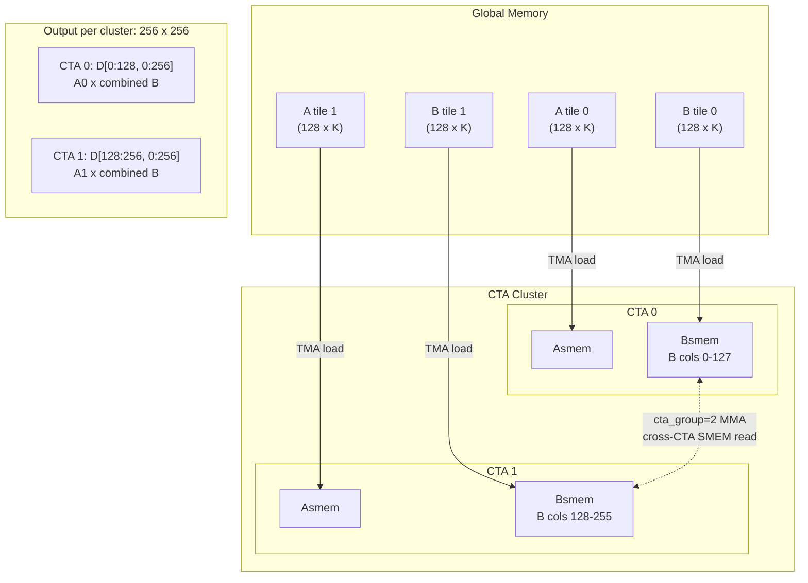

### Step 9: 2-CTA Cluster

**What you will learn:**
- CTA clusters: multiple CTAs cooperating on a larger tile
- Cross-CTA SMEM access: `cta_group=2` MMA reads B from both CTAs
- Cross-CTA barrier signaling with `cta_mask`
- `cta_group=2` for wider MMA output (MMA_N = BLK_N * CTA_GROUP = 256)

**Background:**

With clustering, two CTAs form a cooperative group. Each CTA has its own shared memory, but they can access each other's SMEM via the `shared::cluster` address space.

The key optimization: with `cta_group=2`, the MMA hardware can read B from **both** CTAs' shared memory via the `shared::cluster` address space. Each CTA loads only 128 columns of B into its own SMEM, but the MMA sees all 256 columns across both CTAs. This doubles the output width without additional memory bandwidth.

Although only CTA-0's elected thread issues the MMA instruction, **both CTAs' Tensor Cores compute simultaneously**. Each CTA reads A from its own SMEM (different M rows). For B, both CTAs' SMEM is mapped into a shared `shared::cluster` address space — the MMA hardware reads B from both CTAs' SMEM at the same offset, concatenating them into 256 columns. Each CTA produces a 128 x 256 output in its own TMEM, and the cluster tile is 256 x 256.

**New concepts:**
- **Cluster CTA ID**: `cbx, cby = Tx.cta_id([CTA_GROUP, 1], parent="cluster")` — position within the cluster.
- **Kernel CTA ID**: `bx = Tx.cta_id([SM_COUNT], parent="kernel")` — which SM.
- **Remote barrier view**: `tma2mma_cta0 = tma2mma.remote_view(0)` — access CTA-0's barrier from any CTA.
- **MMA only on CTA-0**: `if cbx == 0:` — only CTA-0's warp 0 issues MMA commands.
- **Multicast arrive**: `mma2tma.arrive(stage, cta_group=2, cta_mask=3)` — signal both CTAs.
- **TMA arrive only from CTA-0**: `if cbx == 0: tma2mma_cta0.arrive(stage, bytes)`.
- **cluster_sync** instead of **cta_sync** at the end.

**MMA output width:**
With `cta_group=2`, `Tx.gemm_async` outputs `MMA_N = BLK_N * CTA_GROUP = 256` columns (not 128). The epilogue must handle 256 columns of output.

**Implementation hints:**
- `CTA_GROUP = 2`, `MMA_N = BLK_N * CTA_GROUP`
- `m_st` and `n_st` account for cluster position (cbx)
- `ld2mma.init(128 * CTA_GROUP)` — both CTAs' writeback WGs arrive
- Tile scheduler: `num_m_tiles=M//256`, `num_n_tiles=N//256`, `num_clusters=SM_COUNT//2`, `tile_scheduler.init(bx // CTA_GROUP)`
- `tcgen05.alloc` and `tcgen05.dealloc` must use `cta_group=2`
- TMA arrive byte count must include both CTAs: `CTA_GROUP * (BLK_M * BLK_K + BLK_N * BLK_K) * DTYPE_SIZE`

**Test:** `pytest tests/test_step09.py -xvs`